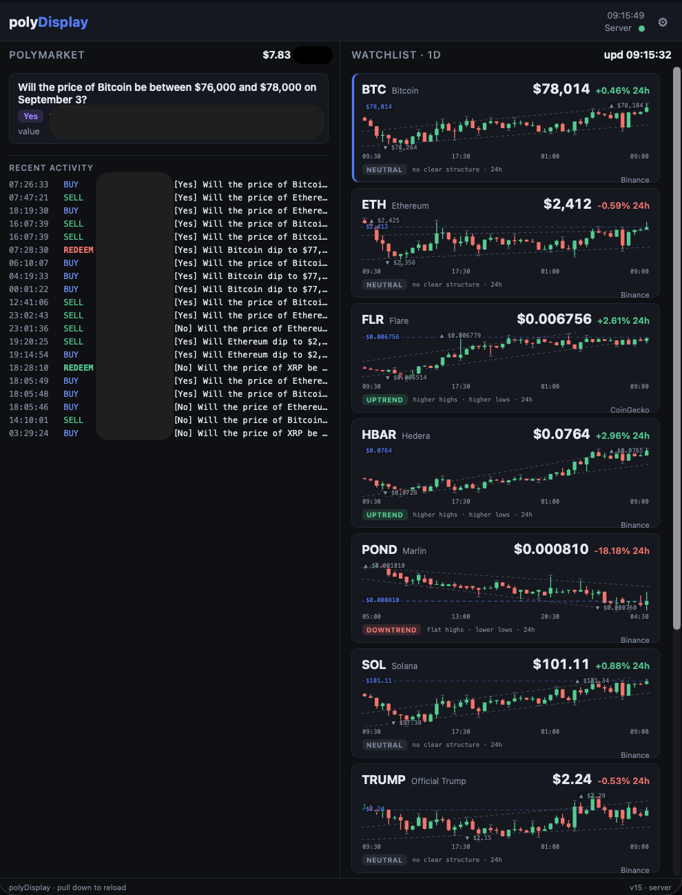

# polyDisplay

[](https://github.com/novatechflow/polyDisplay/actions/workflows/ci.yml)
[](go.mod)
[](LICENSE)

Copyright 2026ff [novatechflow](https://www.novatechflow.com) (Alexander Alten). See `LICENSE`.

LAN dashboard for Polymarket binary trading. Left column is the live book
(positions, PnL). Right column is charts for a mix of trading and monitoring
assets. A Go process on the host serves the page and talks to Polymarket,
Binance, and CoinGecko. Browsers only talk to that process.

```
 ┌────────────┐   http        ┌─────────────────────────────┐   https
 │  pad /     │ ────────────► │  polydisplayd (Go)          │ ──► Polymarket
 │  browser   │  /api/state   │   polls + caches            │ ──► Binance
 │            │ ◄──────────── │   serves the page           │ ──► CoinGecko
 └────────────┘               │   /api/config, /api/search  │
                              └─────────────────────────────┘
```



`server.go` reads `POLYDISPLAY_ASSETS` from the process env or `.env` (see `.env.example`).
Default listen port is 8080 (`POLYDISPLAY_PORT`). Dark/light follows the device. 

## Install (macOS / Linux)

```bash
./install.sh
```

Downloads Go if needed, asks for a Polymarket public address (`0x...`), writes
`config.json`, builds `polydisplayd`, and installs a login service: LaunchAgent
on macOS, systemd user unit on Linux. At the prompt you can add extra tickers;
those are looked up on CoinGecko. Binance is used at runtime when a USDT pair
exists, otherwise CoinGecko.

```bash
POLYMARKET_WALLET=0x... POLYDISPLAY_EXTRA_ASSETS=FLR,HBAR ./install.sh
```

On macOS the agent starts at login. For a box that should come back after
reboot, turn on automatic login. The installer ad-hoc codesigns the binary and
adds a firewall exception if the firewall is on.

`install.sh` prints a 6-digit pad PIN and stores it as `POLYDISPLAY_PIN` in
`.env` (plus `POLYDISPLAY_TOKEN_SECRET`). See Auth below.

Dev without installing a service:

```bash
go run .
```

## Docker

Same image on Linux, macOS, and Windows. No Go toolchain on the host.

```bash
test -f .env || cp .env.example .env
touch config.json
docker build -t polydisplay .
docker run --rm -p 8080:8080 --env-file .env -v "$PWD/config.json:/app/config.json" polydisplay
```

`touch config.json` before the first run so Docker mounts a file, not a
directory. `.env.example` has no PIN; without `POLYDISPLAY_PIN` the API is
open. Copy a PIN and `POLYDISPLAY_TOKEN_SECRET` from a machine that ran
`install.sh`, or set them yourself, then pass `--env-file .env`.

## Open it

On the LAN: `http://<host-ip>:8080` (or `POLYDISPLAY_PORT`).

On a public VM, put Caddy in front as an HTTPS reverse proxy to that port
(`localhost:8080` by default). Keep `POLYDISPLAY_PIN` set so `/api/*` is not
open. The pad still uses the plain URL.

## Auth

When `POLYDISPLAY_PIN` is set (always after `install.sh`):

1. Open the normal pad URL. Type the six-digit PIN once (printed at install;
   otherwise `POLYDISPLAY_PIN` in `.env`).
2. The browser stores an access token (15 min) and a refresh token (30 days)
   in `localStorage` and sends `Authorization: Bearer` on every `/api/*` call.
3. Access expiry refreshes silently. If both tokens are gone (cleared site
   data, ⚙ Reload · clear cache), type the PIN again.

Wrong PIN five times locks that client for two minutes. The page, icons, and
manifest stay public. `config.json`, `.env`, logs, and source are not served.

If `POLYDISPLAY_PIN` is unset (`go run .` with no PIN in `.env`), `/api/*` is
open. That is for local dev only.

### Pad home screen

iPad Safari: Share, then Add to Home Screen (or Add to Dock). Open the icon
for fullscreen. Drag it onto the Dock if it landed on the home screen.
Home-screen icons are `media/icon-180.png` / `192` / `512` (full-bleed square,
not pre-rounded).

Android Chrome: menu, Add to Home screen. On plain `http://` this is usually a
shortcut, not a standalone app.

Keep the pad on a charger. Turn Auto-Lock off if it should stay up. On iPad,
Guided Access (Settings, Accessibility) can lock the device to that icon.

## Config

Watchlist: `POLYDISPLAY_ASSETS` in `.env`. The example is BTC, ETH, SOL, XRP.
Format `SYM:Name:coingecko-id`. Restart after edits. Extra tokens later: ⚙
search, or run `./install.sh` again and add them at the prompt.

Port: `POLYDISPLAY_PORT` in `.env`, else `config.json` `port`, else 8080.
Wallet and candle range: ⚙ or `config.json`. Pad PIN: `POLYDISPLAY_PIN` in
`.env`. Optional `CG_DEMO_KEY` in `.env` for a higher CoinGecko rate limit.

If ⚙ has saved a `coins` list into `config.json`, that list wins until you
delete the `coins` key. `config.json` and `.env` are gitignored.

Logs: `polydisplay.log` in the working directory. Rolled at local midnight to
`polydisplay.log.YYYY-MM-DD`; files older than 5 days are deleted.

## Data

Candles and prices: Binance when a USDT pair exists, otherwise CoinGecko.
Positions: Polymarket data-api.

`GET /api/state`, `GET|POST /api/config`, `GET /api/search?q=` (bearer when
PIN is set). `POST /api/auth/pin`, `POST /api/auth/refresh`.

Pull down at the top of a column, or ⚙ then Reload, to fetch a fresh page.

## License

Copyright 2026ff [novatechflow](https://www.novatechflow.com) (Alexander Alten).

polyDisplay is licensed under the [PolyForm Shield License 1.0.0](https://polyformproject.org/licenses/shield/1.0.0). You may run, change, and share it, including for internal use. You may not provide a product that competes with it, including a paid or hosted service that is a practical substitute. Full terms are in `LICENSE`.
